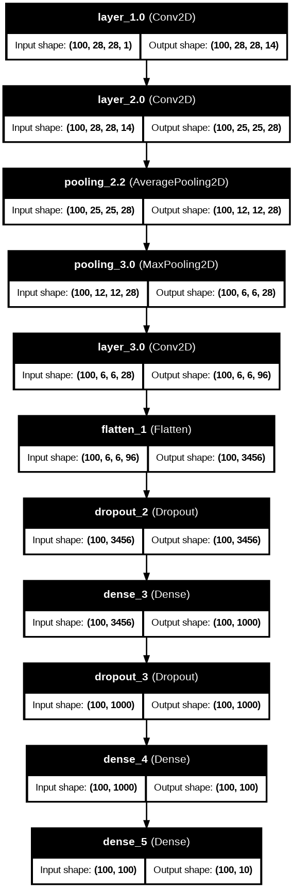

# cnn-assignment# cnn-assignment
My implementation for the resolution of the 4th assignment from STRATEGOS course.
The objective is to train a Convolutional Neural Network in Keras, increasing the performance while optimizing the architecture.

In the python notebook it is possible to set a boolean parameters to check the model graphically.
It will generate/print a PNG image (tested on GOOGLE COLAB). The below image  refers to the architecture of the implemented CNN.  
 
  
